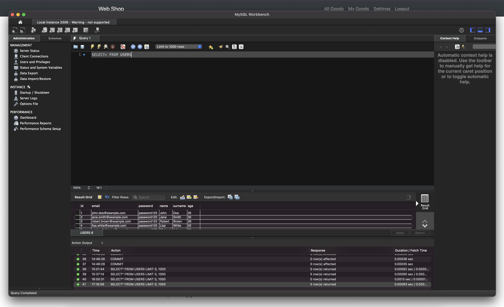

# 🌐 Web Store (Java)

This project is my personal educational project, created in 2017 while attending programming courses. The web store is developed using **Java**, **HTML**, **CSS**, and **MySQL**. It demonstrates basic skills in web application development, database interaction through **MySQL Connector**, and implementing server-side logic using **Servlets**.

---

## 🛠️ Features

The project includes the following capabilities:

### 👤 User Features:
- **Registration** — creating a new user account.
- **Authentication** — logging into a personal account.
- **Password Change** — recovering or changing the password.
- **User Profile** — managing personal information.

### 🛒 Product Features:
- **Adding Products** — publishing new products in the catalog.
- **Deleting Products** — removing unwanted products.
- **Editing Products** — updating product information.
- **Publishing/Hiding Products** — managing their visibility.
- **Product Search** — convenient catalog search.

### 💬 Comment Features:
- **Adding Comments** — users can leave reviews for products.
- **Viewing Comments** — ability to view other users’ comments.

---

## 🚀 Technologies

The project uses the following technologies:

- **Programming Language:** Java
- **Frontend:** HTML + CSS
- **Backend:** Java Servlets
- **Database:** MySQL
- **Database Connection:** MySQL Connector

---

## 📦 How to Run the Project?

### Installing and Setting up MySQL:

1. Install MySQL Server for macOS:
    - [Download MySQL Server](https://dev.mysql.com/downloads/mysql/).
2. Start the server via `System Preferences`.
3. Install MySQL Workbench:
    - [Download MySQL Workbench](https://dev.mysql.com/downloads/workbench/).

### Connecting to the Server:
- Connect via MySQL Workbench using the following parameters:
    - **Host:** `localhost`
    - **Port:** `3306`
    - **Username:** `root`
    - **Password:** `1234java` (replace if different)

### Creating the Database:
Execute the following SQL queries in MySQL Workbench:

```sql
CREATE DATABASE myjdbc;
USE myjdbc;

CREATE TABLE users (
    id INT AUTO_INCREMENT PRIMARY KEY,
    email VARCHAR(255) NOT NULL UNIQUE,
    password VARCHAR(255) NOT NULL,
    name VARCHAR(255) NOT NULL,
    surname VARCHAR(255) NOT NULL,
    age INT NOT NULL
);

CREATE TABLE goods (
    id INT AUTO_INCREMENT PRIMARY KEY,
    id_user INT NOT NULL,
    published INT NOT NULL,
    date DATE NOT NULL,
    time TIME NOT NULL,
    view_count INT DEFAULT 0,
    price INT NOT NULL,
    description TEXT NOT NULL,
    photo TEXT,
    title VARCHAR(255) NOT NULL,
    category INT NOT NULL,
    FOREIGN KEY (id_user) REFERENCES users(id) ON DELETE CASCADE
);

DROP TABLE IF EXISTS comments;

CREATE TABLE comments (
    id INT AUTO_INCREMENT PRIMARY KEY,
    id_goods INT NOT NULL,
    id_user INT NOT NULL,
    title VARCHAR(255) NOT NULL,
    content TEXT NOT NULL,
    date DATE NOT NULL,
    time TIME NOT NULL,
    user_name VARCHAR(255) NOT NULL,
    user_surname VARCHAR(255) NOT NULL,
    FOREIGN KEY (id_goods) REFERENCES goods(id) ON DELETE CASCADE,
    FOREIGN KEY (id_user) REFERENCES users(id) ON DELETE CASCADE
);
```

### Add Test Data to Database:
Execute the following SQL queries in MySQL Workbench:

```sql
INSERT INTO users (email, password, name, surname, age) VALUES
    ('john.doe@example.com', 'password123', 'John', 'Doe', 25),
    ('jane.smith@example.com', 'password123', 'Jane', 'Smith', 30),
    ('robert.brown@example.com', 'password123', 'Robert', 'Brown', 28),
    ('lisa.white@example.com', 'password123', 'Lisa', 'White', 22),
    ('michael.johnson@example.com', 'password123', 'Michael', 'Johnson', 35);

INSERT INTO goods (id_user, published, date, time, view_count, price, description, photo, title, category) VALUES
    (1, 1, '2024-12-01', '12:00:00', 15, 999, 'iPhone 14 Pro Max, 256GB, Space Black', 'iphone14_pro_max.jpg', 'iPhone 14 Pro Max', 1),
    (2, 1, '2024-12-01', '12:15:00', 25, 799, 'iPhone 13, 128GB, Blue', 'iphone13.jpg', 'iPhone 13', 1),
    (3, 1, '2024-12-01', '12:30:00', 30, 1199, 'MacBook Pro 14-inch, M2 Pro, 16GB RAM, 512GB SSD', 'macbook_pro_14.jpg', 'MacBook Pro 14', 2),
    (4, 1, '2024-12-01', '12:45:00', 40, 1499, 'MacBook Air 13-inch, M2, 16GB RAM, 256GB SSD', 'macbook_air_13.jpg', 'MacBook Air 13', 2),
    (5, 1, '2024-12-01', '13:00:00', 50, 599, 'iPad Air 10.9-inch, 64GB, Wi-Fi, Space Gray', 'ipad_air.jpg', 'iPad Air', 3),
    (1, 1, '2024-12-01', '13:15:00', 20, 399, 'Apple Watch Series 8, GPS, 45mm, Midnight', 'apple_watch_series_8.jpg', 'Apple Watch Series 8', 4),
    (2, 1, '2024-12-01', '13:30:00', 10, 199, 'Apple AirPods Pro (2nd generation)', 'airpods_pro.jpg', 'AirPods Pro', 5),
    (3, 1, '2024-12-01', '13:45:00', 5, 1299, 'iMac 24-inch, M1, 8GB RAM, 256GB SSD, Blue', 'imac_24.jpg', 'iMac 24', 6),
    (4, 1, '2024-12-01', '14:00:00', 8, 499, 'Apple TV 4K (2024), 128GB', 'apple_tv_4k.jpg', 'Apple TV 4K', 7),
    (5, 1, '2024-12-01', '14:15:00', 12, 299, 'HomePod mini, Space Gray', 'homepod_mini.jpg', 'HomePod mini', 8);
```

<table>
  <tr>
    <td></td>
    <td></td>
    <td></td>
  </tr>
  <tr>
    <td></td>
    <td></td>
    <td></td>
  </tr>
  <tr>
    <td></td>
    <td></td>
    <td></td>
  </tr>
  <tr>
    <td></td>
    <td></td>
  </tr>
</table>